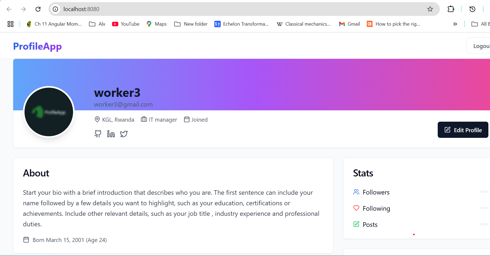
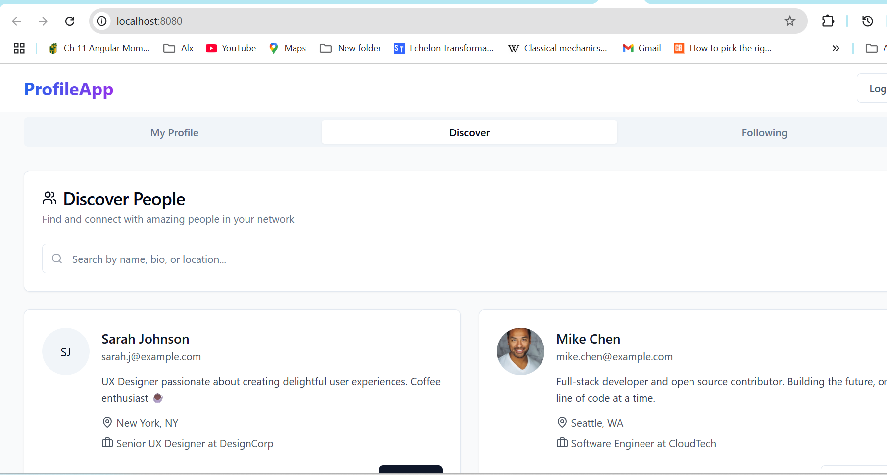

# Profile App Frontend



This is the **frontend** for the Profile App, built with React and TypeScript. It connects to a Flask backend and provides user profile management, discovery, and social features.


This is the **frontend** for the Profile App, built with React and TypeScript. It connects to a Flask backend and provides user profile management, discovery, and social features.

## Features

- User authentication (login/register)
- View and edit your profile
- Upload profile images
- View stats (followers, following, posts)
- Activity feed (recent actions)
- Discover and follow/unfollow other users
- Responsive UI with modern design

## Getting Started


### Prerequisites

- [Node.js](https://nodejs.org/) (v16+ recommended)
- [npm](https://www.npmjs.com/) or [yarn](https://yarnpkg.com/)

### Installation

1. **Clone the repository:**
   ```sh
   git clone https://github.com/yourusername/profile_app.git
   cd profile_app/profile_app_frontend
   ```

2. **Install dependencies:**
   ```sh
   npm install
   # or
   yarn install
   ```

3. **Configure API endpoint:**
   - By default, the frontend expects the backend at `http://localhost:5000`.
   - If your backend runs elsewhere, update the API URLs in your fetch calls.

4. **Start the development server:**
   ```sh
   npm run dev
   # or
   yarn dev
   ```

5. **Open in your browser:**
   - Visit [http://localhost:5173](http://localhost:5173) (or the port shown in your terminal).

## Project Structure

```
profile_app_frontend/
├── src/
│   ├── components/
│   ├── hooks/
│   ├── pages/
│   ├── App.tsx
│   └── main.tsx
├── public/
├── package.json
└── README.md
```

## Environment Variables

If you want to use environment variables for the backend URL, create a `.env` file:

```
VITE_API_URL=http://localhost:5000
```

Then use `import.meta.env.VITE_API_URL` in your code.

## Scripts

- `npm run dev` — Start development server
- `npm run build` — Build for production
- `npm run preview` — Preview production build

## Customization

- **UI:** Built with [Tailwind CSS](https://tailwindcss.com/) and [Lucide Icons](https://lucide.dev/).
- **API:** Expects a Flask backend with endpoints for authentication, profile, follow/unfollow, and user discovery.
